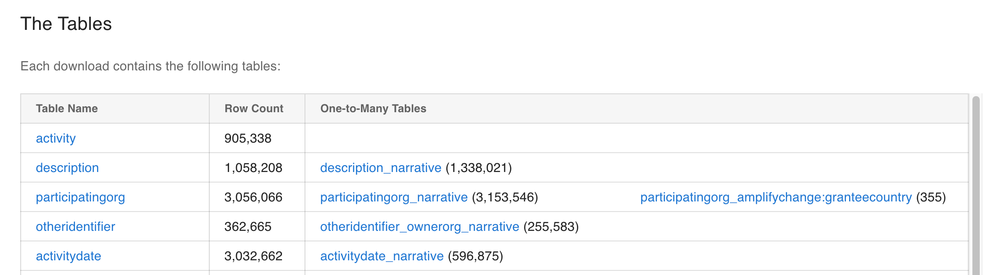
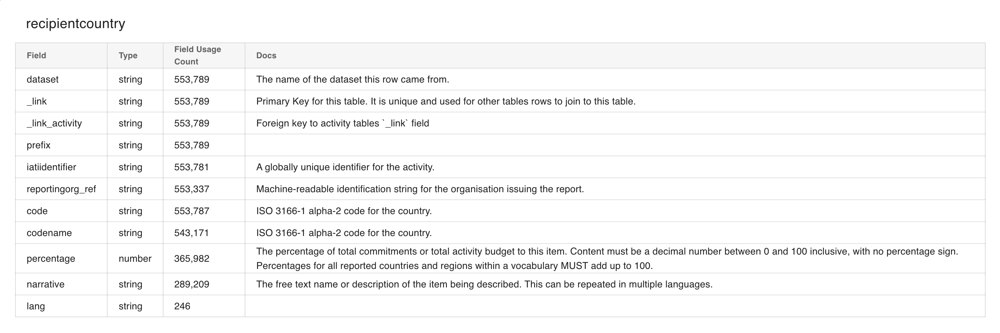
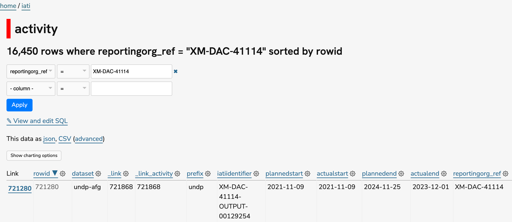

.. _gettingstarted: 

******************
Getting Started
******************

This section briefly explains how to use the `IATI Tables Datasette <https://datasette.tables.iatistandard.org/>`_ instance, and provides some tips and tricks for working with the data.

The Tables
===========

IATI Tables flattens IATI XML into a relational database - a set of structured tables that can be linked together by unique identifiers.
The available tables are described on the IATI Tables `Homepage <https://tables.iatistandard.org/>`_. The number of rows is given for each table. 

    IATI Tables: Available tables

Click on a table name to view detail on the columns in the table, their data type, how many rows contain data, and a brief description of the columns.

    recipientcountry Table Summary

Querying IATI Tables
=======================

To query IATI Tables in the browser, open `IATI Tables <https://datasette.tables.iatistandard.org/iati>`_ and select your table of interest. 
You can then filter the table, using the dropdowns to select a column and an SQL operator, and filling in the freetext box.
Next, click the Apply button to apply the filter, then you can add another filter if needed.

For example, you could filter the `activity <https://datasette.tables.iatistandard.org/iati/activity>`_ table for activities reported by 
UNDP, using their reportingorg_ref XM-DAC-41114.

    The activity table, filtered to activites reported by UNDP